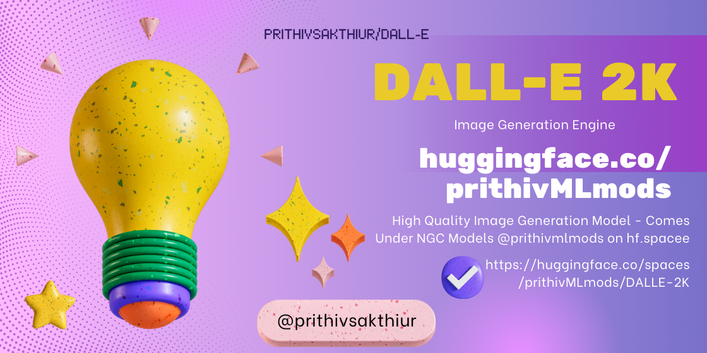
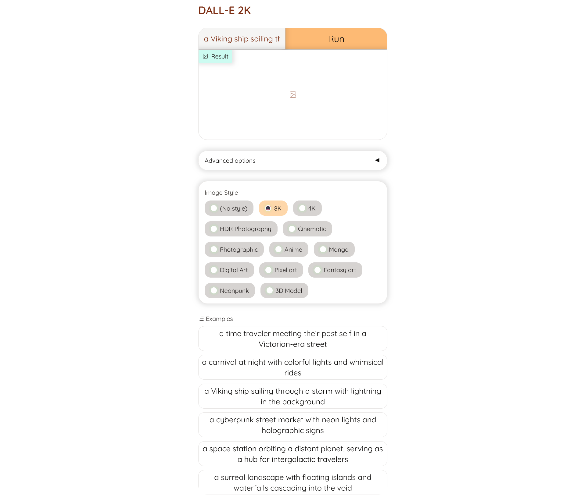
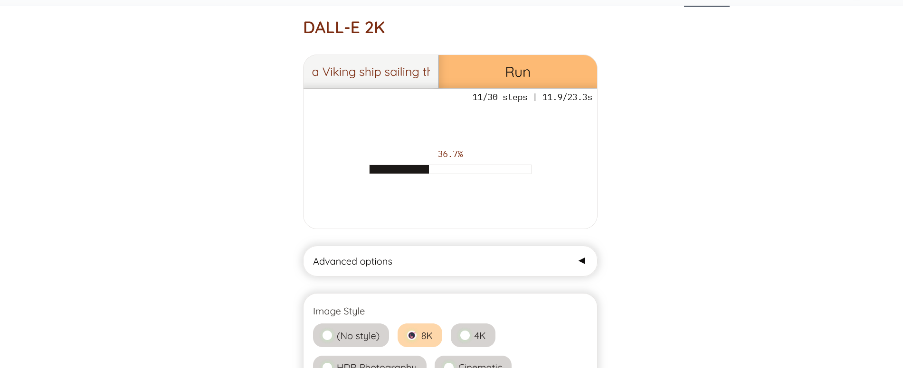
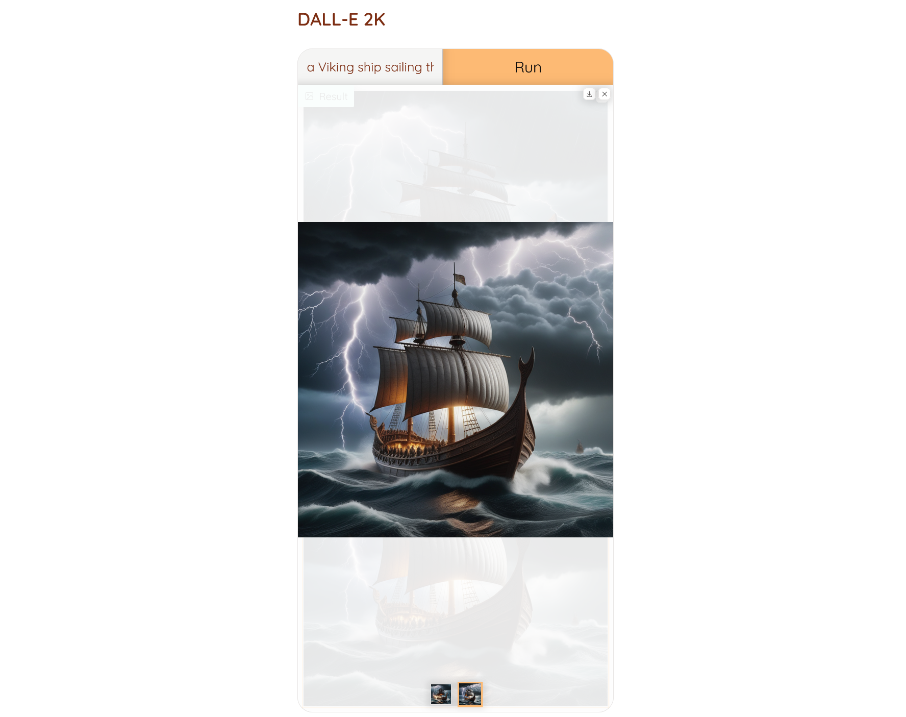
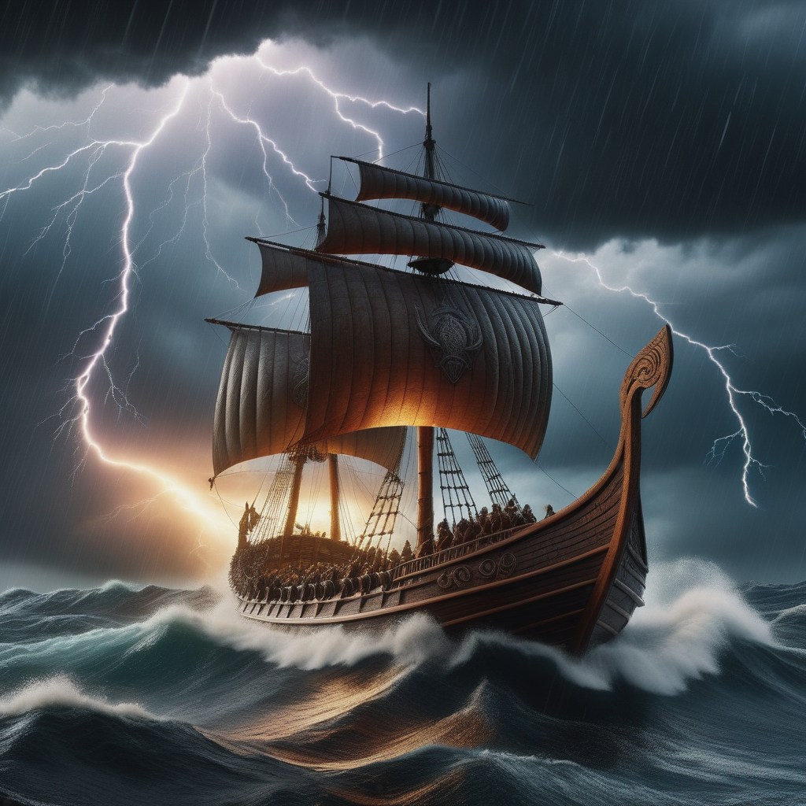
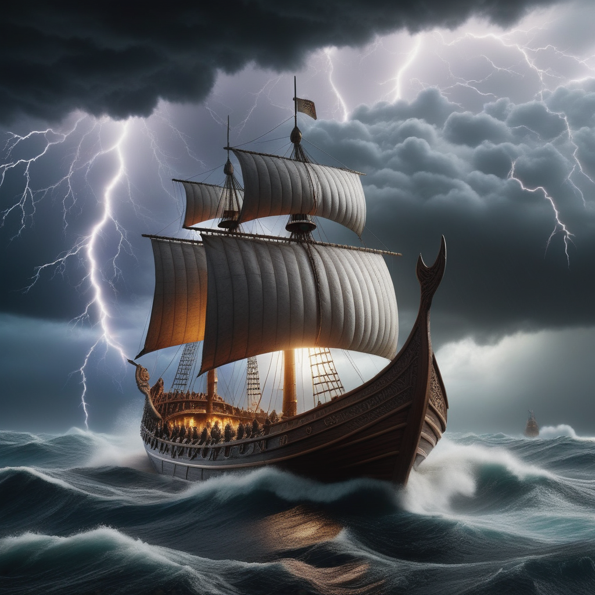

🚀Check out the configuration reference at https://huggingface.co/docs/hub/spaces-config-reference

🚀Huggingface Spaces : https://huggingface.co/spaces/prithivMLmods/DALLE-2K

🚀Docs for Space : 
    
    # Make sure you have git-lfs installed (https://git-lfs.com)
    git lfs install
    
    git clone https://huggingface.co/spaces/prithivMLmods/DALLE-2K
    
    # If you want to clone without large files - just their pointers
    
    GIT_LFS_SKIP_SMUDGE=1 git clone https://huggingface.co/spaces/prithivMLmods/DALLE-2K

## 🔮Input Prompt for Image Generation

    Prompt: "a Viking ship sailing through a storm with lightning in the background"

## ✏️Processing with safetenors deployed

## 🌌The Generated Image Output

## The Images from Dall-e 2k 🍪

|  |  |
|---------------------------|---------------------------|

## requirements.txt 

      torch
      diffusers
      transformers
      gradio
      peft

